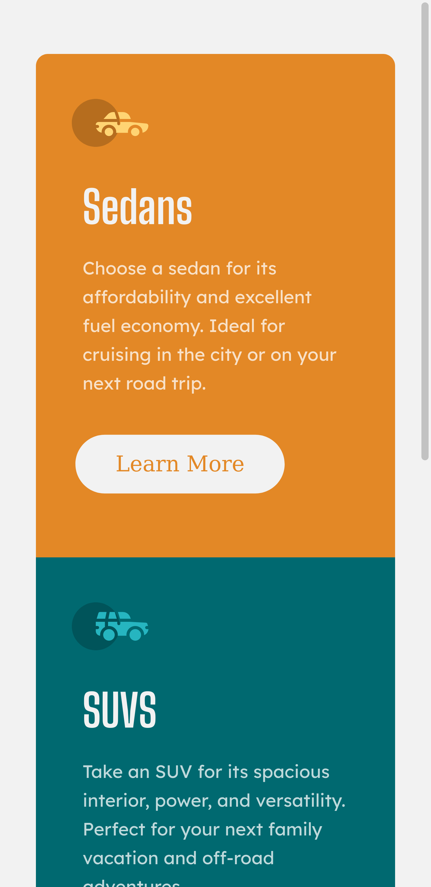
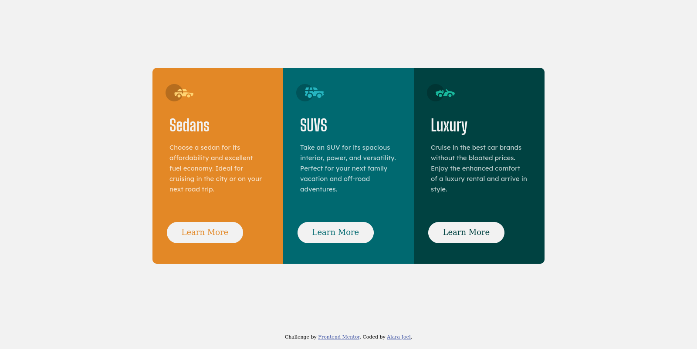

# Frontend Mentor - 3-column preview card component solution

This is a solution to the [3-column preview card component challenge on Frontend Mentor](https://www.frontendmentor.io/challenges/3column-preview-card-component-pH92eAR2-). Frontend Mentor challenges help you improve your coding skills by building realistic projects. 

## Table of contents

- [Overview](#overview)
  - [Requirements](#requirements)
  - [Screenshot](#screenshot)
  - [Links](#links)
- [My process](#my-process)
  - [Built with](#built-with)
  - [What I learned](#what-i-learned)
- [Author](#author)
- [Acknowledgments](#acknowledgments)

## Overview
A 3-column card for a car rentals site. Has two different layout approach for mobile and desktop.

### Requirements

Users should be able to:

- View the optimal layout depending on their device's screen size
- See hover states for interactive elements

### Screenshot




### Links

- Solution URL: [Add solution URL here](https://your-solution-url.com)
- Live Site URL: [Add live site URL here](https://your-live-site-url.com)

## My process

I started by fully structuring out all the content using HTML (although I added icons afterwards, because I like to style them immediately the are added).

Next I added the css styling. I take the desktop first approach beause I think more code goes into building  layouts for desktop, 
and then gradually adding media queries to make it look good on mobile. 
I ensured that responsiveness was attained even at widths of 280px (Iphone 5).

### Built with

- Semantic HTML5 markup
- CSS custom properties
- Flexbox

### What I learned

Learnt a few useful tips in CSS responsive design; especially in sizing

- Using rem or ems to size containers is way better than using Viewport units (vh, vw)
- The border-radius property in Css can be further customized to style each corner of the borders as needed.

```css
.card-1 {
 border-radius: 10px 0 0 10px;
}

```

- The transparent property for background color can be used to remove background color in a hover state

``` 
.cta {
 background-color: white;
border-radius: 30px;
outline: none;
cursor: pointer;
text-align: center;
font: var(--bg-font);
font-size: 1.2em;
}

.cta:hover {
 background-color: transparent; 
 transition: background-color 0.3s ease-in-out;
}
```

## Author

- Website - [Alara Joel](https://alarajoel.tech)
- Frontend Mentor - [@stealthman22](https://www.frontendmentor.io/profile/stealthman22)
- Twitter - [@alara_joel](https://www.twitter.com/alara_joel)

## Acknowledgments

This is where you can give a hat tip to anyone who helped you out on this project. Perhaps you worked in a team or got some inspiration from someone else's solution. This is the perfect place to give them some credit.

- Thanks to [Daniel](https://twitter.com/DanielHoppener) for motivating me to start using frontend mentor to get better at structiring my UI.
